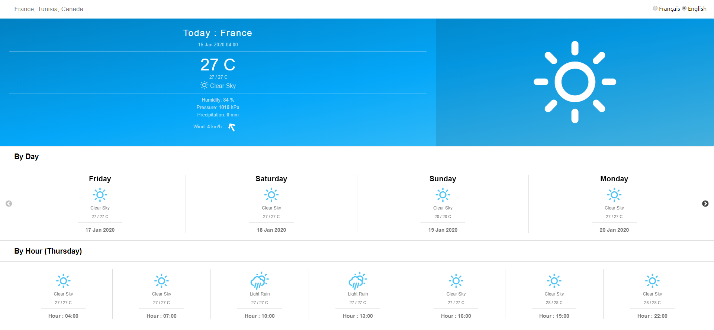

# Weather Forecast


This is a ReactJS project for weather forecast. [Demo](https://reactjs-weatherapp.herokuapp.com/)

## 📸 Screenshots


## 🏁 Getting Started

These instructions will get you a copy of the project up and running on your local machine for development and testing purposes.

### Prerequisites

```
NodeJs, Yarn
```

### Installing

Steps:

```
Clone/ Download the repository
```

And install the packages from the command line:

```
yarn install
```

And start the server:

```
yarn start
```

## Built With

* [ReactJS](https://reactjs.org/) - A JavaScript library for building user interfaces.
* [OpenWeather API](https://openweathermap.org/) - Openweather is a small IT company, established in 2014 by a group of engineers and experts in Big Data, data processing, and satellite imagery processing.

## Authors

* **Skender Lahdhiri** - *Initial work* - [Skenderl](https://github.com/skenderl)

## Acknowledgments

* [react-open-weather](https://www.npmjs.com/package/react-open-weather)

## License

This project is licensed under the MIT License - see the [LICENSE.md](LICENSE.md) file for details
